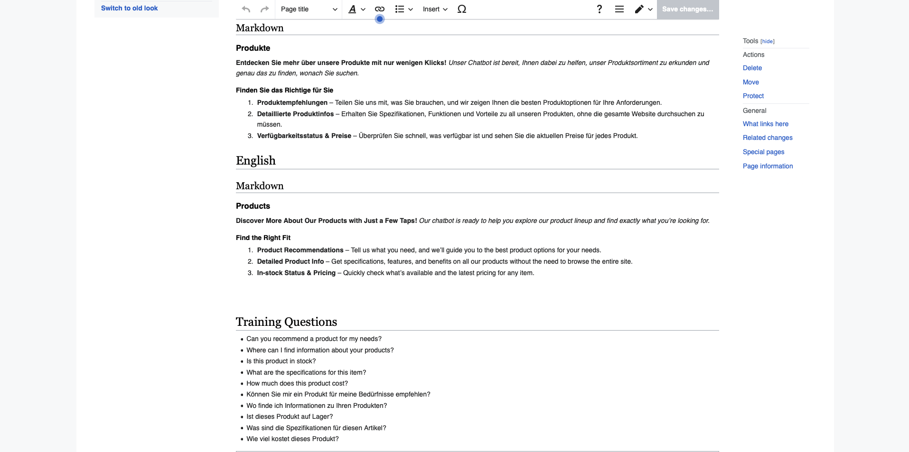
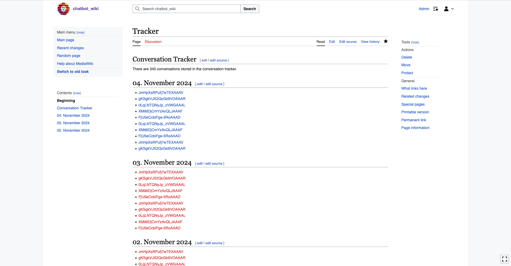

# Using Bergwerk

## Creating or Editing Chatbot Content

Bergwerk organizes chatbot content in a way that enables both easy editing and robust categorization. Every piece of information the chatbot provides, along with potential user interactions, is stored as a wiki page. Each page serves as a self-contained unit within a hierarchical structure, allowing the intent classifier to effectively respond to a wide range of user inputs.

### Page Structure

Each Bergwerk installation includes a **Start** page that users see after accepting the Terms of Service (ToS). This page can be accessed directly at:
[http://localhost/wiki/w/index.php?title=Start](http://localhost/wiki/w/index.php?title=Start).

The **Start** page is designed to guide users as they begin interacting with the chatbot. Key points about page structure:

- **Single-Use Visibility**: The **Start** page appears only once—immediately after ToS acceptance. To create instructions or content that users view repeatedly, configure these elements on the "Home" page or other pages within the content hierarchy.
- **Content Organization**: Each chatbot content page should include the `[[Category:Content]]` tag. This tag allows the page to be included in intent classifier training and ensures it will be exported when moving content across systems.
- **Hierarchy Structure**: Think of the chatbot’s content structure as a tree, where each page represents a “branch” with connections to other branches, leading users through a logical flow of information.

### Chatbot Answers

Each answer the chatbot provides is separated into different language sections to support multilingual responses. Currently, **English** and **German** sections are supported. Each language section includes a "Markdown" subsection for that language's response.

- **Markdown Sections**: Within each language section, create a `== Markdown ==` subsection. This area holds the chatbot’s output in the respective language, such as greeting messages, answer explanations, or follow-up prompts. To render markdown directly, wrap text in `<markdown>` and `</markdown>` tags, although these tags are not required for the webchat plugin.

#### Example of Chatbot Answer in English

```markdown
= English =

== Markdown ==
Hello! Welcome to Bergwerk. How can I assist you today?
```

### Chatbot Buttons

Buttons provide clickable options that guide users through the chatbot’s responses. Adding buttons is an effective way to create a navigable experience.

- **Adding Buttons**: To include buttons, add a `== Buttons ==` subsection within the relevant language section. Each button links to another page, creating an interactive experience for users. Use standard wikitext link format to reference other pages, formatted as `[[Page title in Wiki|Button Text]]`.
- **Formatting Buttons**: Begin each button entry with an asterisk (`*`) followed by a space. This format lists options in a clean, organized way for users.

#### Example of Chatbot Buttons in English

```markdown
= English =

== Buttons ==
* [[Help Page|Get Help]]
* [[FAQ|View FAQs]]
* [[Settings|Configure Settings]]
```

### Training Questions

Training questions are essential to improve the chatbot’s ability to understand user intent. Each content page should contain examples of phrases or questions that lead users to that page. Providing diverse examples helps the intent classifier identify and respond accurately.

- **Creating Training Questions**: In each language, add a minimum of **10 example sentences**. For instance, if the content page is designed to answer questions about “Setting Up an Account,” the examples should include common ways users might phrase that inquiry.
- **Formatting Training Questions**: Each example starts with an asterisk (`*`) followed by a space.

#### Example of Training Questions in English

```markdown
= English =

== Training Questions ==
* How do I set up an account?
* Can you help me create an account?
* I need assistance with account creation.
* What steps are required to set up a profile?
* Tell me how to get started with an account.
* Guide me through account setup.
* How to open a new account?
* Is it possible to register a new account?
* Help with creating an account, please.
* Instructions for setting up my account.
```

By using these structures and adhering to these guidelines, you can efficiently manage, expand, and refine Bergwerk's chatbot content to create a user-friendly and effective chatbot experience.




### Tracker Page

To ensure that your chatbot is functioning as expected, it is essential to review its interactions with users. This review process can be performed on the **Tracker Page** within the Bergwerk wiki.

The **Bergwerk cron service** is configured to log conversations regularly (by default, every hour) by writing them to the tracker page. This allows you to:

- Review past conversations and evaluate the chatbot's responses.
- Identify gaps in the knowledge base where users have asked questions that the chatbot couldn’t answer.
- Continuously improve your chatbot by adding relevant content based on actual user interactions.

By using the tracker page, you can make data-driven improvements to enhance the chatbot's performance and user experience.


